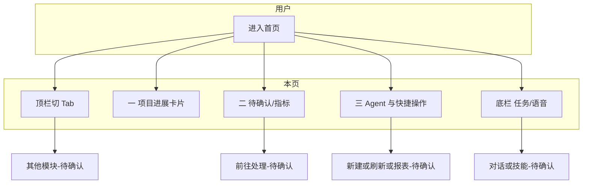

# PRD Generator Skill  
# PRD生成技能

`prd-generator` 用于把原型图和需求说明转成可评审的 Markdown PRD。  
`prd-generator` turns prototypes and requirement notes into review-ready Markdown PRDs.

它默认优先产出「某个产品功能需求详述」，避免一开始就写空泛全文。  
By default, it prioritizes detailed requirement sections instead of drafting a vague full document too early.

它适用于产品、研发、测试协作场景，强调可实现、可测试、可验收。  
It is designed for Product, Engineering, and QA collaboration with implementation- and testing-ready details.

## 核心能力  
## Core Capabilities

支持按页面类型生成需求详述（列表、卡片、表单、看板、信息展示）。  
Supports page-based requirement drafting (list, card, form, dashboard, info display).

支持 AI/策略类需求描述（输入、输出、预期效果、Bad Case）。  
Supports AI/strategy requirement specs (input, output, expected effects, bad cases).

可在需要时汇编完整 PRD（概述、全局说明、详述、埋点、数据、风险等）。  
Can assemble a full PRD when needed (overview, global rules, details, tracking, data, risks, etc.).

在交付前可执行产品/开发/测试三视角自检并修订正文。  
Can run a Product/Engineering/QA self-review pass before delivery and revise the draft.

## 典型使用方式  
## Typical Usage

上传原型后说「请写这个功能的 PRD 详述」。  
Upload a prototype and ask: “Write the detailed PRD section for this feature.”

如果你要完整文档，可以明确说「请输出完整 PRD（全章节）」。  
If you need the full document, explicitly ask: “Generate a full PRD with all chapters.”

如果是局部改动，请标注影响区域并说明改动目标。  
For partial iterations, mark affected areas and describe the intended changes.

如果是 AI 场景，请补充输入来源、输出形式和效果预期。  
For AI scenarios, provide input sources, output format, and expected outcomes.

## 输出特点  
## Output Characteristics

文档结构标准化，便于评审、排期和测试用例拆解。  
The structure is standardized for easier review, planning, and test case design.

无依据信息不会臆造，未知项会标记为「待确认」。  
Unsupported assumptions are not fabricated; unknowns are marked as “To Be Confirmed.”

描述偏工程化，减少口号式表述，提高落地效率。  
The writing style is engineering-oriented to improve implementation efficiency.

## 仓库建议  
## Repository Suggestions

建议将模板、参考章节和示例输出放在独立目录中。  
Keep templates, chapter references, and sample outputs in dedicated folders.

建议在 README 中补充一组输入示例与生成结果截图。  
Add example inputs and output screenshots in the README.

建议补充 LICENSE 与贡献指南，便于团队协作和开源管理。  
Include a LICENSE and contribution guide for team collaboration and open-source readiness.

# 示例
# case
## 原型(prototype)：

## 提问（prompt）：
请生成这个页面的prd

## PRD：

# 产品需求：信贷行业全流程管理 Agent 工具 - 首页（工作台）

> 说明：依据桌面端静态原型《首页.html》（React + 单页「首页」Tab）整理；**未在仓库内落原型截图时**请将浏览器全页截图存至下节约定路径，以便评审对照。

## 3 产品需求详述

### 3.1 首页/工作台

#### 1 原型截图

*请将 `c:\Users\zhangmi1\Desktop\首页.html` 在浏览器中打开后，截取**当前「首页」Tab 与首屏可滚动全页**（或按「欢迎区/项目进展/需确认事项/Agent 与快捷操作/底部任务输入」分多张），保存为上述相对路径；若 PRD 文件在 `docs/` 下，则图片位于 `docs/assets/...` 时路径相应调整。下同。*

**原型与交付差异说明（基于源码核对）：** 代码中存在「待办列表」`PendingItem` 组件与示例数据，**当前首屏主流程未渲染该列表**；下文字段以**首屏已展示区域**为准。若产品意图为「二、需您确认/处理」下方必须展示**按优先级待办列表**，**待确认** 后纳入迭代范围与验收范围。

#### 2 功能说明

| 页面/区域 | 功能说明 | 备注 |
| --- | --- | --- |
| 模块与入口 | 产品对外名称：**信贷行业全流程管理 Agent 工具**；本页为登录后**默认或主导航「首页」** 对应的工作台/汇报视图 | 与「项目/Build/收件箱」的并列关系、默认落地页**待确认** |
| 全局顶栏 | 品牌区 **CreditAI**（含图形标识 + 文案）；主导航 **首页、项目、Build、收件箱** 为 Tab/路由切换；右侧用户区占位 | 各 Tab 点击后的路由、权限与未实现态**待确认** |
| 欢迎区 | AI 助理人格 **小K**，展示**时段问候**（如上午/下午/晚间）与一句固定引导语，概括「今日项目进展 + 待办/待确认」的汇报入口 | 问候语与真实时区/用户设置是否一致**待确认** |
| 一、近期项目进展 | 标题区展示**统计截止时间**（示例：`截至 3 月 5 日 15:00`），下方 **3 列**（小屏可降为单列）卡片，每卡展示**子域名称、状态徽标、摘要说明、完成度条（0～100%）** | 三个子域为：**信贷风控、授信报告、商机拓展**；与后台项目配置是否一一对应**待确认** |
| 二、需您确认/处理 | 分左右两列（大屏）或上下堆叠（小屏）呈现**高优先级需处理事项**：**信贷风控（S 级）** 含汇总数字与 2 条可跟进行项；**授信报告（A 级）** 含四格统计与项目成员 | 「前往处理」的去向（子页/抽屉/外跳）**待确认**；成员是否可点击、是否展示更多成员**待确认** |
| 三、Agent 详情 + 快速操作 | 主区：展示**商机识别 Agent** 基本信息（名称、角色、状态、头像、**能力描述**、**任务清单**含勾选框与行状态）；副区：「快速操作」**新建项目、刷新数据、查看报表** | Agent 与当前用户/项目的绑定关系**待确认**；能力描述是固定简介还是可配置**待确认** |
| 底部任务输入 | 长输入框，占位为「请输入任务或使用技能」；右侧**麦克风**按钮；下方三个图标按钮（加号、无限、灯泡）**弱操作入口** | 是否对接真实对话/技能编排、是否支持语音采集与流式回写**待确认** |

#### 3 字段说明

##### 3.1.1 顶栏

| 字段名称 | 字段说明 | 约束条件 | 示例 | 注释 |
| --- | --- | --- | --- | --- |
| 品牌区-CreditAI | 产品名展示 | 文本+图标 | CreditAI | 点按是否回首页**待确认** |
| 导航-首页/项目/Build/收件箱 | 主导航切换 | 单选高亮，底边线指示当前 | 当前：首页 | 各 Tab 目标路由、未上线时的禁用或「敬请期待」**待确认** |
| 用户头像区 | 当前用户身份入口 | 圆形头像占位 | 置灰圆 | 点击是否展开账户/登出/设置**待确认** |

##### 3.1.2 欢迎区

| 字段名称 | 字段说明 | 约束条件 | 示例 | 注释 |
| --- | --- | --- | --- | --- |
| 主标题 | 助理称呼 + 时段问候 | 需支持不同时段与可扩展（节日等）**待确认** | 您好！我是您的专属助理小K，上午好 ☀️ | emoji 是否可关**待确认** |
| 副标题 | 对下方内容的概括说明 | 单行或多行，超长 **省略 + Tooltip**（同全局 2.4 约定，若全篇无 **2 全局说明** 则在此写明采用省略与悬停展示全文） | 已为您整理今日核心项目进展与待办事项，以下是近期工作汇报： | — |

##### 3.1.3 一、近期项目进展

| 字段名称 | 字段说明 | 约束条件 | 示例 | 注释 |
| --- | --- | --- | --- | --- |
| 区块标题 | 含**截至时间**的汇报口径 | 时间需与数据一致、可带刷新后的更新时间 | 一、近期项目进展（截至 3 月 5 日 15:00） | 时间由服务端/前端计算**待确认**；是否支持**自动/手动刷新**后更新**待确认**（进行中类状态无感刷新时须符合团队「进行中状态自动更新」的通用约定，若与本文冲突以团队 **2.4** 为准） |
| 项目卡片-标题 | 子域/项目名称 | 文本 | 信贷风控、授信报告、商机拓展 | — |
| 项目卡片-状态徽标 | 展示阶段状态 | 预置配色（如进行中/待审批/待审阅）与字典一致 | 进行中、待审批、待审阅 | 枚举以业务为准**待确认** |
| 项目卡片-摘要 | 进展摘要，可能含**预警条数、待办动作** | 多行文本，超长省略 + Tooltip | 如：触发 xx 风控告警 14 条，待查阅 | 文案为 AI 生成或规则拼接**待确认** |
| 项目卡片-完成度 | 0～100% 的条形进度与文案 | 整数或一位小数**待确认** | 75% | 进度来源与可编辑性**待确认**（本页**只读展示**为默认） |

**会触发请求的操作（本区块默认无独立按钮，数据依赖整页/区块拉取时）：** 见「4. 异常情况说明」；若后续增加「展开详情」「进入项目」等，须**单独补充**：请求中 **loading、按钮禁用、防重复点击**。

##### 3.1.4 二、需您确认/处理

**信贷风控（S 级）**

| 字段名称 | 字段说明 | 约束条件 | 示例 | 注释 |
| --- | --- | --- | --- | --- |
| 子标题/优先级 | 子域 + S 级徽标 | 文案 | 信贷风控；S 级 | 等级枚举与红系配色 |
| 汇总四数 | 已完成/待完成/成功/失败 | 非负整数，千分位**待确认** | 15 / 10 / 1 / 4 | 统计口径、统计周期、是否与列表一致**待确认** |
| 项目介绍 | 数据来源说明长文案 | 长文本，省略+Tooltip | xx 集团、xx 公司的工商、招投标、舆情、产业链等 | 纯展示/可点关键词**待确认** |
| 子项-风险共振等 | 图标+说明文案 | 左侧图标+右侧描述 | 例如：风险共振指数 0.72（中高）… 已生成名单/草稿 | 多条子项的排序规则、最多条数**待确认** |
| 子项-前往处理 | 主操作按钮 | 主色按钮，点击有副作用 | 前往处理 | 跳转目标、是否需要二次确认、**请求中 loading+禁用** **待确认**；实现后需补防连点 |

**授信报告（A 级）**

| 字段名称 | 字段说明 | 约束条件 | 示例 | 注释 |
| --- | --- | --- | --- | --- |
| 子标题/优先级 | 授信报告 + A 级 | 同左栏风格 | 授信报告；A 级 | 配色区分 |
| 项目介绍 | 同左，略 | 可截断 | …… |  |
| 四格指标 | 已完成/待完成/成功/失败 | 四宫格+强调数字 | 156/8/142/14 | 同口径问题同左 |
| 项目成员 | 头像组 | 可重叠圆头像，最多显示 N+「更多」**待确认** | 3 人头像 | 人员数据来源与隐私**待确认** |

##### 3.1.5 三、Agent 详情与快速操作

| 字段名称 | 字段说明 | 约束条件 | 示例 | 注释 |
| --- | --- | --- | --- | --- |
| Agent-名称/角色/状态 | 名称+英文角色+状态徽标 | 状态如「工作中」/空闲等字典 | 商机识别 Agent；Digital Agent；工作中 | 多 Agent 切换是否本期**待确认** |
| Agent-头像/在线点 | 头像+绿色在线点动画 | 在线含义（真在线/展示用）**待确认** | — | 头像失败占位图 |
| Agent-能力描述 | 能力长文本 | 只读 | 从海量数据识别商机、NLP+持续学习 等 | 可配置/固定模板**待确认** |
| 任务清单-行 | 任务名+行状态+勾选 | 多行；**勾选**是仅 UI 还是可改状态**待确认** | 已完成/进行中 等 | 与业务任务单是否双向同步**待确认**；若提交接口则须 loading+禁用+失败回滚 |
| 快速操作-新建项目 | 主操作 | 全宽主按钮 | 新建项目 | 跳转/弹窗/权限**待确认**；有接口则防连点 |
| 快速操作-刷新数据 | 刷新全页/区块数据 | 次主按钮 | 刷新数据 | 与欢迎区/项目等刷新范围**待确认**；**请求中全按钮禁用或本按钮 loading** |
| 快速操作-查看报表 | 跳转报表 | 主按钮 | 查看报表 | 目标**待确认** |

##### 3.1.6 底部任务输入

| 字段名称 | 字段说明 | 约束条件 | 示例 | 注释 |
| --- | --- | --- | --- | --- |
| 文本框 | 自然语言任务/技能 | 可占位；回车/发送**待确认**；最大长度、敏感词**待确认** | placeholder：请输入任务或使用技能 | 是否多行、是否@技能**待确认** |
| 麦克风 | 语音输入入口 | 点击后行为（转写/唤起浏览器权限）**待确认** | — | 无权限/拒绝时的提示**待确认** |
| 下排图标-加号/无限/灯泡 | 扩展能力 | 点按后果**待确认** | 图标可 hover 高亮 | 与对话/工作流产品对齐后定稿 |

##### 3.1.7 脱敏、权限与可见性（有资料再收紧）

| 角色/条件 | 字段或区块 | 可见性 | 展示 |
| --- | --- | --- | --- |
| **待确认** 与信贷角色、机构、数据权限关系 | 一/二/三 区块及数字、任务、成员 | 是否按**机构/项目/职级**裁剪 | 无材料时**不**预设矩阵；上线前需补充 |

#### 4 异常情况说明

| 场景 | 界面表现 | 文案/操作示例 | 备注 |
| --- | --- | --- | --- |
| 全页/首屏数据加载中 | 各区块**骨架/Spin**，避免白屏与布局跳动 | — | 是否分区块独立失败**待确认**；主路径至少一种可感知加载态 |
| 全页/区块请求失败 | 该区块**错误态 + 重试**；其他区块可保留上次成功 | 「加载失败，请重试」 | 与「只刷新本区块」/「重试全页」策略**待确认** |
| 统计数字为空或无权限 | 用 **0** 或 **「--」** 或**隐藏**整卡 | — | 与**指标口径**一致；敏感指标降权**待确认** |
| 欢迎语/时间依赖接口失败 | 可降级为默认问候+静态副标题 | 默认**待确认** | 不阻塞主区展示 |
| 头像/外链图片失败 | 占位图/首字母**待确认** | — | 失败重试**待确认** |
| 无网络/超时 | Toast 或内联提示；已展示数据**是否保留** | 「网络异常」 | **待确认** |
| 子项**前往处理**失败 | 按钮可恢复、Toast 说明原因 | — | 实现后需验收 |

**验收要点：**

1. 顶栏、四大区块、底部输入的布局与**原型**一致；关键文案（含 S/A 级、状态枚举）与**业务字典**一致后可通过评审。
2. 所有**已确定会调接口的按钮**（至少：**前往处理、刷新数据、快速操作、语音/提交若落地**）具备：loading/禁用/防连点/失败可恢复，若团队已有 **2.4 全局约定** 则与之一致。
3. 一、二区「截至时间/汇总数字/任务行」的**时间基准与成功/失败定义**有书面口径后方可测数值正确性；此前以「展示不报错、可重试、空/无权限可解释」为最低验收线。

#### 5 与关联模块的接口与流程（简图）

与 **项目列表、Build、授信报告、风控子应用、消息收件箱、对话/技能** 的跳转、参数、回传若未另立 PRD，在评审单中**待完善**后统一在「全局流程」稿中收束。

### 3.2 本需求待完善与待确认

| 序号 | 项 | 说明 |
| --- | --- | --- |
| 1 | 主导航各 Tab 的路由、权限、未实现态 | 与「仅首页可演示」的偏差 |
| 2 | 二 区块是否补充「按优先级待办列表」`PendingItem` 数据与交互 | 与源码中未渲染的组件是否对齐产品意图 |
| 3 | 前往处理/新建/报表/刷新 的精确目的地与入参、审计要求 | 信贷合规模块 |
| 4 | 任务清单勾选、底部输入/麦克风 的**真对接范围**与降级策略 | 与 Agent 服务 SLA |
| 5 | 统计数字与「截至时间」的**出数时间 T+N、延迟提示** | 与风控/授信贷后数据一致 |
| 6 | 多角色、多法人的可见性与数据隔离 | 权限矩阵 |

---

*本稿经产品/开发/测试三视角合并修订：补齐异常与可验收点、不臆造接口与权限细节；与「全局 2.4」冲突时以团队统一版为准。*
Uploading PRD-信贷行业Agent-首页-产品需求详述.md…]()

