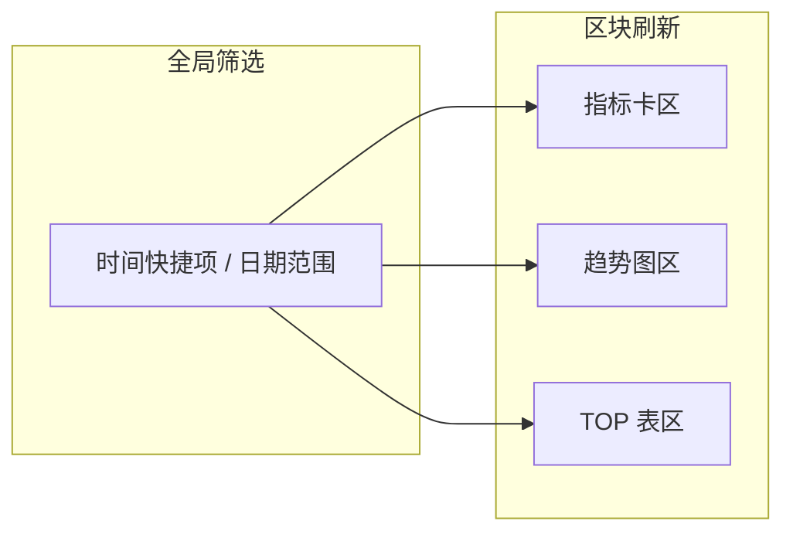

# 单功能需求模板：统计页 / 数据看板

> 适用：**多指标卡 + 多图表（折线/柱状/饼/组合等）+ 可选明细表/TOP 排行**；强调 **统计口径、时间粒度、T+N 时效、坐标轴与 Tooltip 格式、全局/局部筛选联动**。  
> **编排位置**：交付稿中置于 `## 3 产品需求详述` 下，作为 `### 3.x.x …` 功能小节（可再拆成 `3.x.1 总览指标区`、`3.x.2 趋势图` 等子小节；**勿把本 `>` 说明块原样复制进对外 PRD**）。  
> 结构对齐列表页/卡片页范式：**1 原型截图 → 2 功能说明 → 3 字段说明 → 4 异常情况说明 → 5 联动、下钻与状态（流程示意图）**。其中「字段」含 **统计截止时间文案、全局与分图筛选、刷新/导出、每张图/每个指标卡/每张表** 的配置项，不仅指业务主键。  
> **默认交互**：凡会发起请求的按钮（**查询、重置、手动刷新、导出、应用筛选** 等），须在「字段说明」中写明 **loading 形态（按钮内菊花/文案/区块骨架）**、**请求中是否禁用**、失败/成功后如何恢复可点，防止连续点击重复提交（与 **2.4 全局交互与展示约定** 一致）。  
> **数据时效**：须写明 **T+N / 准实时**、**统计截止时间**（如自然日 0 点 / 业务日切点）、**出数可延迟** 等，避免与「当前时刻」混读。  
> **文字超长**：指标名、图例、表格单元格等展示不全时，按 **2.4**：末尾 **「…」/「...」** + **鼠标悬停气泡** 展示全文。  
> **图表/指标加载**：各区块数据加载可感知时须有 **loading 或骨架占位**；分区块异步加载时须约定 **是否独立失败重试**、**是否保留上次成功数据**。

（小节标题示例：`### 3.x.x 【看板名称】`；首段可写一句总述，如：「用于展示【业务域】在【时间/组织等维度】下的规模、变化与结构，支撑【决策/运营】。」）

---

## 1 原型截图

> **（给智能体 · 勿原样保留本块）** 交付稿本节须含 **``**（整页过长可拆为多张：全局 / 单区块）；路径以本 PRD 文件为根，推荐 `./assets/prototypes/<模块>-<看板>-<状态>.png`；仓库尚无文件时仍写**约定路径**并提示保存原图。**禁止**仅文字描述而无 ``。建议覆盖：**菜单路径与入口**、**统计截止时间/数据说明**、**全局筛选**、**各指标卡栅格**、**各图表区**（图例、双轴、下钻入口）、**明细表或 TOP 排行**、**刷新/导出**、空状态；局部迭代附圈选图。

---

## 2 功能说明

按页面区域说明用途；**一行一个区域或一条能力**。


| 页面 | 功能说明 | 备注 |
| --- | --- | --- |
| （如：模块/菜单路径-页面名） | 功能入口：登录后如何进入本页（可有多个入口） |  |
| 数据时效与口径说明区 | 展示 T+N、统计截止时间、是否含「今日」等，避免用户误读 | 可与「统计截止时间」字段同文案来源 |
| 全局筛选区 | 控制 **全局生效** 的维度；变更后刷新哪些区块须在第 3 节写清 |  |
| 指标总览区 | 核心 KPI 卡片：**累计、同环比、昨日变化** 等 |  |
| 趋势/对比区 | 折线、柱状、组合图等 |  |
| 结构/分布区 | 饼图、堆叠柱、桑基等（如有） |  |
| 明细/TOP 区 | 表格、TOP10/TOPN（如有） |  |
| 工具栏 | **手动刷新**、**导出**、**全屏**（如有） |  |

（按实际看板增删行，勿留空表。）

---

## 3 字段说明

下列对象统一填入本表：**统计截止时间、各筛选项（含快捷时间/日期范围）、查询/重置/刷新、各指标卡、各图表（坐标轴/图例/Tooltip/双轴）、各表格列、导出** 等。  
列含义：**字段名称**为界面展示名或控件名；**字段说明**为行为与业务含义；**约束条件**含类型、枚举、默认值、格式、最大跨度、是否含当日等；**示例**填示例值或示例文案；**注释**填权限、与原型差异、**未上线指标用「--」或隐藏**、**同【某字段】** 等引用。

对 **会触发接口** 的控件，须在「字段说明」或「注释」中写清：**loading**、**禁用**、失败/成功反馈。

**篇幅较长时**，可按 Word 示例拆成多张表：先 **「3.1 公共（全局）字段」**，再 **「3.2 【区块名称】」** 每张表对应一个原型上的大块区域（总览指标 / 单张图 / 单张表）。

### 3.1 公共（全局）字段

| 字段名称 | 字段说明 | 约束条件 | 示例 | 注释 |
| --- | --- | --- | --- | --- |
| 统计截止时间 / 数据说明 | 固定文案 + 动态时间，告知用户「数截止到何时」 | 时间精度须约定（如 `yyyy-MM-dd 00:00:00`）；是否与 T+N、出数延迟一致 | 「统计截止于：2022-03-30 00:00:00」 | 可与第 2 节「数据时效」互链 |
| 时间快捷筛选（如有） | 一键切换常用时间窗 | 枚举：**近 7 天 / 近 30 天** 等；**是否不含「今日」**；默认值 | 近 7 天 | 与「日期范围」互斥或联动须写明 |
| 日期范围筛选（如有） | 自定义起止日期，驱动 **全局或部分图** | **仅过去 / 是否可选今日**；**最大跨度**（如 90 天）；超限 **Toast** 文案 | 起止各选一天 | 与快捷筛选同时存在时的优先级 |
| 其他全局维度（如有） | 组织、业务线、环境等 | 下拉/多选；默认值；是否影响全部区块 |  |  |
| 查询 / 应用 | 按当前条件拉取或刷新看板 | 按钮 |  | loading + 禁用 |
| 重置 | 恢复默认筛选并刷新 | 按钮 |  | 默认项须在约束中列全 |
| 手动刷新（如有） | 重新请求当前条件数据 | 按钮 |  | 须防重复提交；是否只刷新失败块见注释 |
| 导出（如有） | 导出当前筛选下 **图表数据/表格/全页** | 格式（Excel、CSV、图片）；行数/次数限制 |  | 异步导出时须约定通知方式 |

（按实际页面增删行。）

### 3.2 【区块名称：如「核心指标卡」】

| 字段名称 | 字段说明 | 约束条件 | 示例 | 注释 |
| --- | --- | --- | --- | --- |
| 【指标卡】累计-xxx | 指标业务含义 | **数字格式**：千分位；**单位**（个/次/元）；**≥ 阈值** 时单位切换规则 | 1,234 |  |
| 【指标卡】昨日变化-xxx | 相对前一日的增量或变动值 | 正数前缀 **+** / 负数 **-** / 持平无符号；**配色**（涨/跌/平） | +567 个 | 与品牌色规范冲突时在注释说明 |
| 【指标卡】信息 icon（如有） | 悬停展示指标定义或统计口径 | Icon + Tooltip 文案固定 | 「被调用至少 1 次的数量」 |  |
| 【指标】本期不做 | 占位展示规则 | 显示 **「--」** 或 **整卡/曲线隐藏** | -- | 须与路线图或版本标注一致 |

（每个指标卡一行或一对「累计/变化」两行；按实际增删。）

### 3.3 【区块名称：如「趋势折线图」】

| 字段名称 | 字段说明 | 约束条件 | 示例 | 注释 |
| --- | --- | --- | --- | --- |
| 本区块时间筛选（如有） | **仅影响本图** 的快捷项或日期范围 | 同 3.1 或子集；默认与全局关系：**继承 / 独立** |  |  |
| 图类型 | 折线/面积/柱/组合 |  |  |  |
| 图例 | 各系列名称；**本期下线的系列** 是否隐藏 | 点击图例是否隐藏该系列 |  |  |
| 横轴 | 维度与格式 | 如日期 `YYYY-MM-DD`；排序方向 |  |  |
| 纵轴 | 指标单位与精度 | **单轴 / 双轴**；左轴含义；右轴含义（若为双轴） | 轴 1：次数；轴 2：个数 | 双轴刻度须防误读，可在注释要求视觉区分 |
| Tooltip | 悬停气泡内容结构 | **多系列分行展示**；字段顺序；**无数据** 时展示「--」或隐藏 | 日期 + 各系列名与值 | 示例见下「Tooltip 示例」 |
| 空数据 | 无数据点或整段无数据 | 断线 / 补零 / 整图空态 |  |  |
| 下钻（如有） | 点击数据点进入 **列表/详情** 的路由与参数 | 携带时间切片与维度 |  |  |

**Tooltip 示例（可复制到示例列）：**

```text
2022-03-23
表资产：1,000,000 个
API 资产：1,000,000 个
指标资产：--
```

### 3.4 【区块名称：如「柱状 + 曲线组合图」】

| 字段名称 | 字段说明 | 约束条件 | 示例 | 注释 |
| --- | --- | --- | --- | --- |
| （继承 3.3 中图例、坐标轴、Tooltip 等行，本表可只写差异项） |  |  |  |  |
| 柱系列-xxx | 每日累计或当日值含义 | 与左/右轴绑定关系 |  |  |
| 线系列-xxx | 趋势含义 | 与左/右轴绑定关系 |  |  |
| Tooltip | **多指标单位**（次、个）分行 | 数字千分位；**≥1 亿** 时单位「亿次/亿个」等 | 见 3.3 示例结构 |  |

### 3.5 【区块名称：如「昨日热门 API TOP10」表格】

| 字段名称 | 字段说明 | 约束条件 | 示例 | 注释 |
| --- | --- | --- | --- | --- |
| 排名 | 正整数序号 | 1～N 连续 | 1 |  |
| 对象名称列 | 展示名称 | 超长省略 + Tooltip |  |  |
| 核心度量列 | 如调用次数 | 千分位；单位；≥1 亿显示规则 | 1,234 次 |  |
| 排序规则 | 默认排序字段与方向 | 主排序；**同分** 时次要键（如名称字母序） | 调用次数降序 | **固定 TOPN 且无翻页** 时写明 |
| 分页（如有） | 与 TOPN 固定展示冲突时二选一 | 每页条数 |  | Word 示例为共 10 条不分页 |

---

## 4 异常情况说明

描述**看板在数据或请求异常时的界面表现与交互**，避免仅依赖原型而未约定文案与行为。  
与第 3 节对照：**筛选无结果、整页无数据、单图失败、部分区块失败、导出失败** 等须区分。


| 场景 | 界面表现 | 文案/操作示例（可替换为实际稿） | 备注 |
| --- | --- | --- | --- |
| 整页无数据（无权限或无业务数据） | 全页或分区空状态 | 主文案：「暂无数据」；副文案与「调整筛选」引导 | 与权限占位是否区分 |
| 筛选条件下无数据 | 指标卡为 0 或「--」；图表空态；表格空态 | 「所选时间范围内暂无数据」 | 与「统计尚未完成」是否区分 |
| 统计尚未完成 / 延迟出数 | 顶部提示条或区块内说明 | 「数据计算中，预计 xx:xx 更新」 | 与 T+N 文案一致 |
| 区块加载中 | **骨架屏** / 区块级 Spin | — | 是否阻塞其他区块操作 |
| 单区块请求失败 | 该区块错误占位 + **重试**；其他区块保留成功数据 | 「加载失败，请重试」 | 重试范围：**单块** / **整页** |
| 全局请求失败 | 错误页或整页 Toast | 「网络异常」；「重试」刷新整页 |  |
| 日期跨度超限 | Toast | 「日期范围不能超过 90 天」 | 与 3.1 约束一致 |
| 导出失败 / 超限 | Toast 或弹窗 | 「导出条数超过上限」 |  |
| 无权限查看部分指标 | 脱敏、「--」或隐藏整块 | 「您暂无权限查看该指标」 | 与第 5 节权限矩阵一致 |

（按实际页面增删行，勿留空表。）

---

## 5 联动、下钻与状态（流程示意图）

描述 **全局筛选 ↔ 各区块** 的刷新关系、**下钻页** 携带参数、**权限导致的指标可见性**、**本期未上线指标** 的展示策略。  
建议使用 **Mermaid** `flowchart` 表达「筛选变更 → 哪些区块重新请求」；必要时用表格做 **角色-区块-指标** 矩阵。




**文字条款示例（按需保留或改写）：**

1. **筛选联动**：全局日期变更时，**指标卡、折线图、TOP 表** 均重新请求；**某图内** 若另有局部日期筛选，是否覆盖全局须写明优先级。
2. **统计口径一致**：同一页面上 **「统计截止时间」** 与 **各区块数据切片** 使用同一时间基准（自然日/业务日一致）。
3. **本期不做**：指标资产等系列 **显示「--」** 或 **图例/曲线隐藏**，与产品路线图标注一致。
4. **下钻**：点击 **数据点 / 表格行** 打开详情，携带 **时间、维度、对象 ID**；返回看板时是否保留筛选状态。
5. **并发与重复请求**：快速切换筛选时，是否 **取消上一次请求**、以 **最后一次** 结果为准（避免慢请求覆盖新结果）。

（与第 4 节重复的边界可择一处详写、另一处引用。）

---

## 6 指标定义附录（可选，复杂看板建议使用）

当单一「字段说明」表不足以写清口径时，对每个指标或图表系列使用下表 **逐条** 附录（可复制多份）。


| 项 | 内容 |
| --- | --- |
| 指标或系列名称 |  |
| 指标定义 / 业务口径 |  |
| 计算公式 |  |
| 分子 / 分母 / 数据来源 |  |
| 时间粒度与是否含当日 |  |
| 单位、精度、舍入规则 |  |
| 同环比（如有） |  |
| 空 / 延迟 / 无权限展示 |  |

---

## 7 权限、性能与验收要点

**权限与脱敏**

- 角色可见 **区块 / 指标 / 下钻目标页** 差异：
- 敏感字段脱敏规则：

**性能**

- 大数据量：**抽样、异步聚合、分页、限制最大查询跨度** 等策略：
- 分区块并行请求的 **并发数** 或 **串行顺序**（如有）：

**验收要点（编号列表）**

1. 统计截止时间、T+N 与各区块数据一致。
2. 快捷时间、日期范围、**不含今日**、**最大 90 天** 等约束与 Toast 与原型一致。
3. 指标 **正负变化配色**、**千分位与单位切换**、**「--」占位** 符合约定。
4. **双轴图** 轴含义、Tooltip 多行格式、图例与系列隐藏逻辑正确。
5. **TOPN 排序、同分 tie-breaker、固定条数无翻页**（若适用）正确。
6. **加载/失败/重试/导出** 交互与第 3、4 节一致。
